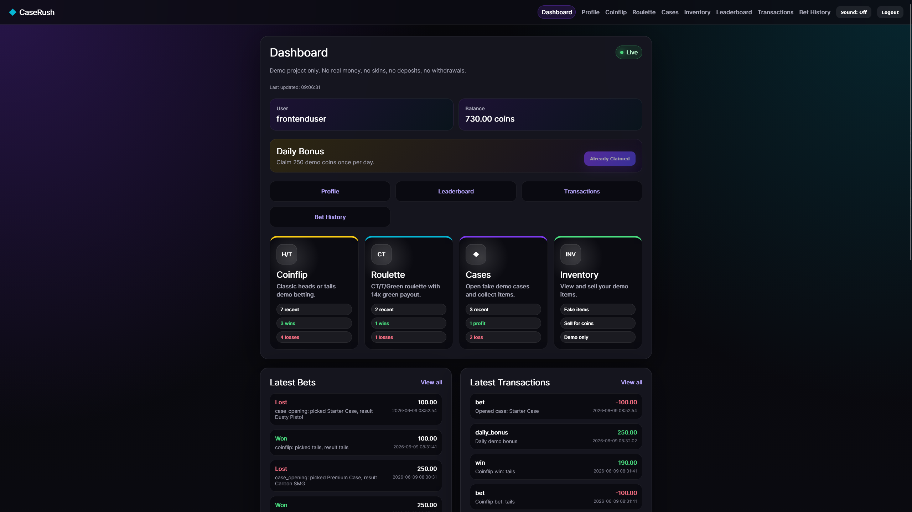
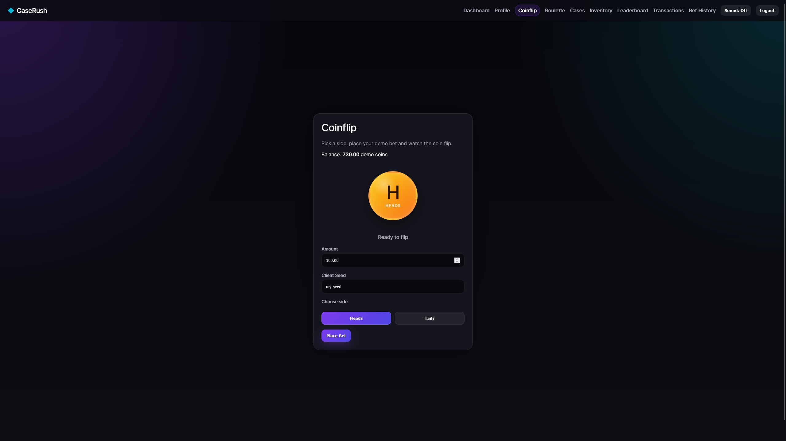
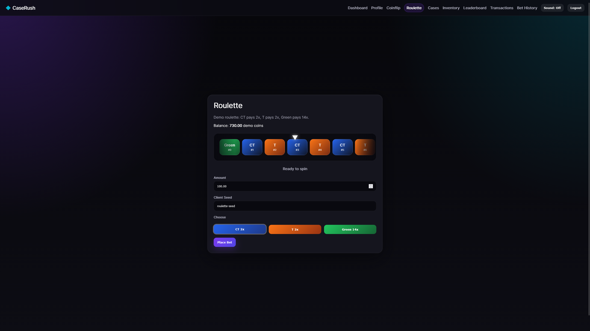
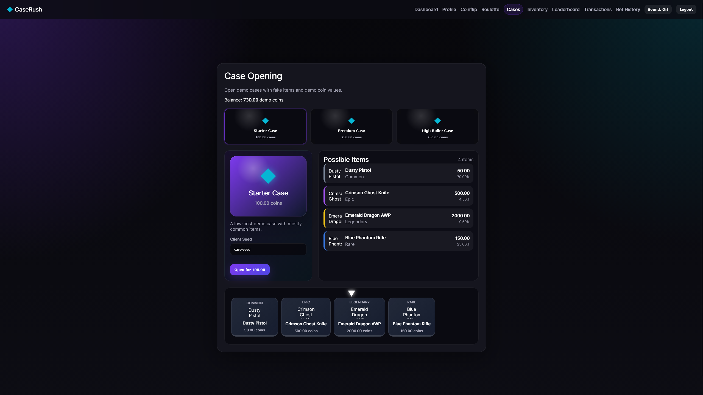
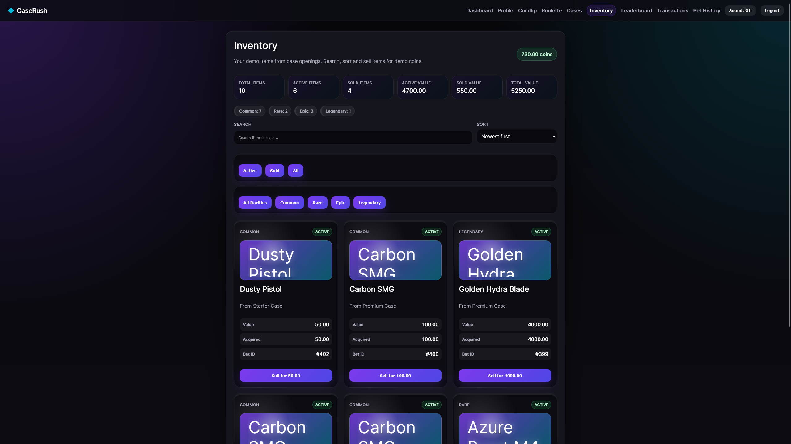
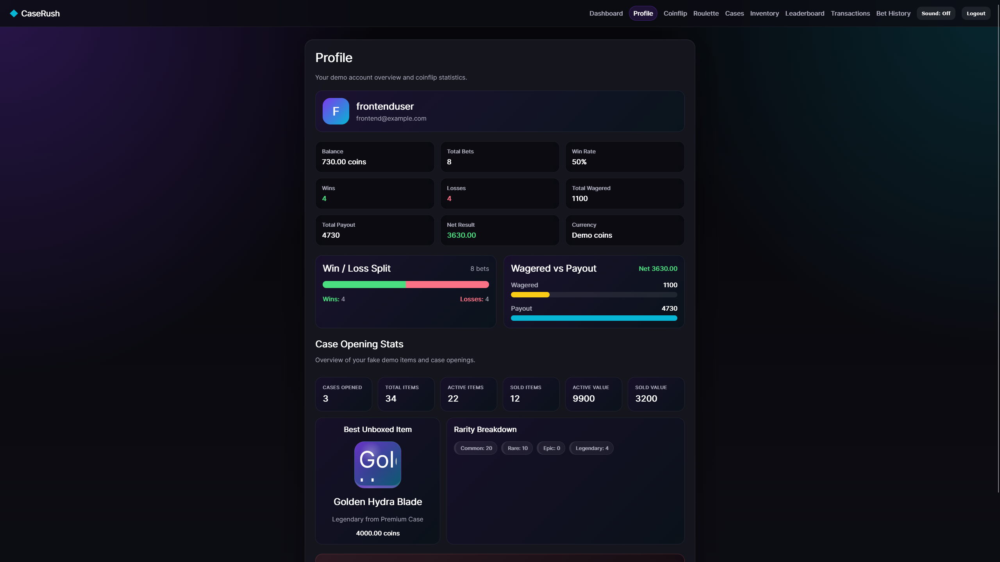
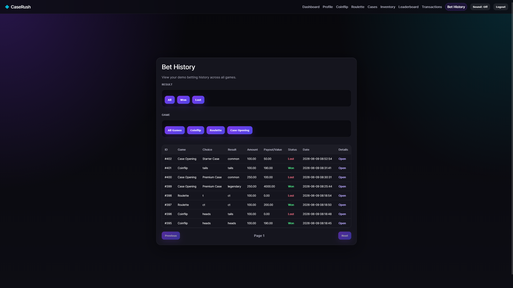
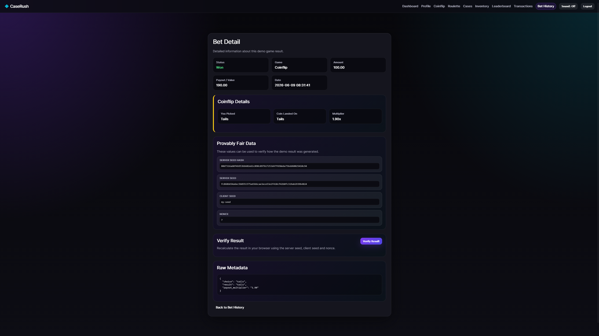
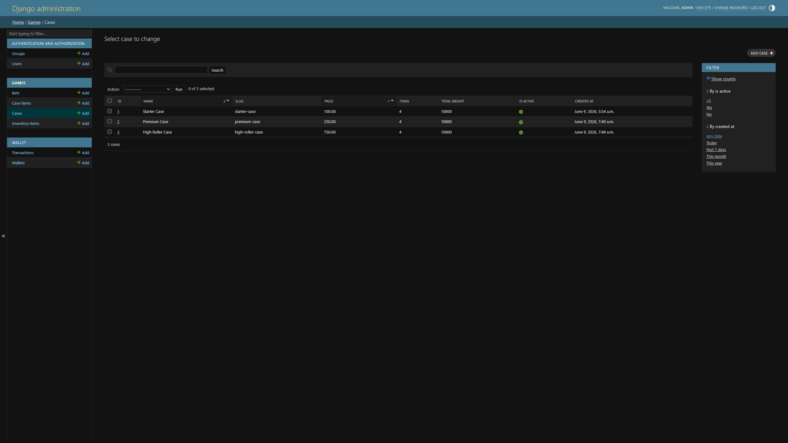

# CaseRush

**CaseRush** is a full-stack demo gaming dashboard built with **React**, **Django REST Framework**, and **SQLite**.

Users can register an account, log in, use fake demo coins, play animated demo games, open cases, collect fake items in an inventory, view statistics, and verify game results with a browser-based provably fair system.


---

## Screenshots

### Dashboard



### Coinflip



### Roulette



### Case Opening



### Inventory



### Profile



### Bet History



### Bet Detail / Provably Fair Verification



### Django Admin



---

## Features

### Authentication

* User registration and login
* JWT authentication
* Token refresh handling
* Protected frontend routes
* User profile endpoint

### Demo Wallet

* Fake demo coin balance
* Starting balance for new users
* Daily bonus
* Transaction history
* Demo account reset
* Leaderboard

### Games

* Coinflip
* Roulette
* Case opening
* Animated game interfaces
* Game result history
* Individual bet detail pages
* Win/loss tracking
* Payout calculation

### Case Opening & Inventory

* Multiple demo cases
* Weighted fake item drops
* Item rarity system
* Item images
* Inventory with active and sold states
* Sell fake items for demo coins
* Search inventory items
* Sort inventory by value, rarity, and newest
* Filter inventory by rarity and status
* Inventory value summaries

### Statistics

* Profile statistics
* Win/loss overview
* Total wagered
* Total payout
* Net result
* Case opening statistics
* Best unboxed item
* Rarity breakdown
* Inventory value summaries

### Provably Fair Verification

* Server seed
* Server seed hash
* Client seed
* Nonce
* HMAC SHA-256 result generation
* Browser-based result verification
* Coinflip verification
* Roulette verification
* Case opening verification with item weight snapshots

### Admin

* Django Admin dashboard
* Manage wallets and transactions
* Manage cases and case items
* Manage inventory items
* View bets
* Export selected bets as CSV
* Case odds overview
* Inventory profit overview
* Bet net result overview

---

## Tech Stack

### Frontend

* React
* Vite
* JavaScript
* React Router
* Axios
* HTML
* CSS
* LocalStorage
* Web Audio API
* Web Crypto API

### Backend

* Python
* Django
* Django REST Framework
* Simple JWT
* Django ORM
* Django Admin

### Database

* SQLite

### Tools

* Git
* GitHub
* npm
* Python virtual environment
* dotenv
* CORS headers
* Django tests

---

## Project Structure

```text
caserush/
  backend/
    config/
    games/
    users/
    wallet/
    manage.py
    requirements.txt
    .env.example

  frontend/
    public/
      items/
    src/
      api/
      components/
      pages/
      utils/
      App.jsx
      main.jsx
      index.css
    .env.example

  screenshots/
    dashboard.png
    coinflip.png
    roulette.png
    cases.png
    inventory.png
    profile.png
    bet-history.png
    bet-detail.png
    admin.png

  README.md
  .gitignore
```

---

## Getting Started

### 1. Clone the repository

```bash
git clone https://github.com/LunkanL/caserush.git
cd caserush
```

Replace the URL with your own GitHub repository URL.

---

## Backend Setup

Go to the backend folder:

```bash
cd backend
```

Create a virtual environment:

```bash
python -m venv venv
```

Activate the virtual environment.

On Windows:

```bash
venv\Scripts\activate
```

On macOS/Linux:

```bash
source venv/bin/activate
```

Install backend dependencies:

```bash
pip install -r requirements.txt
```

Create an environment file:

```bash
cp .env.example .env
```

Run migrations:

```bash
python manage.py migrate
```

Seed demo cases:

```bash
python manage.py seed_demo_cases
```

Create an admin user:

```bash
python manage.py createsuperuser
```

Start the backend server:

```bash
python manage.py runserver
```

Backend URL:

```text
http://127.0.0.1:8000/
```

---

## Frontend Setup

Open a new terminal and go to the frontend folder:

```bash
cd frontend
```

Install frontend dependencies:

```bash
npm install
```

Create an environment file:

```bash
cp .env.example .env
```

Start the development server:

```bash
npm run dev
```

Frontend URL:

```text
http://localhost:5173/
```

---

## Environment Variables

### Backend `.env.example`

```env
DJANGO_SECRET_KEY=change-me
DJANGO_DEBUG=True
DJANGO_ALLOWED_HOSTS=127.0.0.1,localhost
CORS_ALLOWED_ORIGINS=http://localhost:5173
```

### Frontend `.env.example`

```env
VITE_API_BASE_URL=http://127.0.0.1:8000/api
```

---

## Main API Endpoints

### Authentication

```text
POST /api/auth/register/
POST /api/auth/token/
POST /api/auth/token/refresh/
GET  /api/auth/me/
```

### Wallet

```text
GET  /api/wallet/
GET  /api/wallet/transactions/
POST /api/wallet/daily-bonus/
GET  /api/wallet/leaderboard/
POST /api/wallet/reset-demo/
```

### Games

```text
POST /api/games/coinflip/bet/
POST /api/games/roulette/bet/
GET  /api/games/cases/
POST /api/games/cases/:id/open/
GET  /api/games/inventory/
POST /api/games/inventory/:id/sell/
GET  /api/games/bets/
GET  /api/games/bets/:id/
GET  /api/games/profile-stats/
GET  /api/games/case-stats/
GET  /api/games/activity-feed/
```

---


## Provably Fair System

CaseRush stores the following data for each game result:

* Server seed
* Server seed hash
* Client seed
* Nonce
* Result
* Metadata

The backend generates game results using **HMAC SHA-256**.

The frontend can recalculate the result in the browser using the stored values and compare it with the saved result.

For case openings, the backend stores an item snapshot with item weights. This makes it possible to verify old case openings even if case items are changed later.

This feature is included for educational purposes and transparency inside the demo project.

---

## Running Checks

Backend check:

```bash
cd backend
python manage.py check
```

Backend tests:

```bash
python manage.py test
```

Frontend production build:

```bash
cd frontend
npm run build
```

---

## Future Improvements

Possible future improvements:

* Online deployment
* PostgreSQL for production
* More dashboard analytics
* More case designs
* Improved item card animations
* Admin analytics endpoint
* Automated frontend tests
* Improved accessibility
* Theme toggle

---

## Author

Created by Jesper Lundqvist.

---

## Repository

```text
https://github.com/LunkanL/caserush
```
